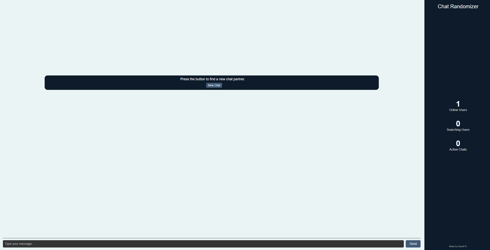
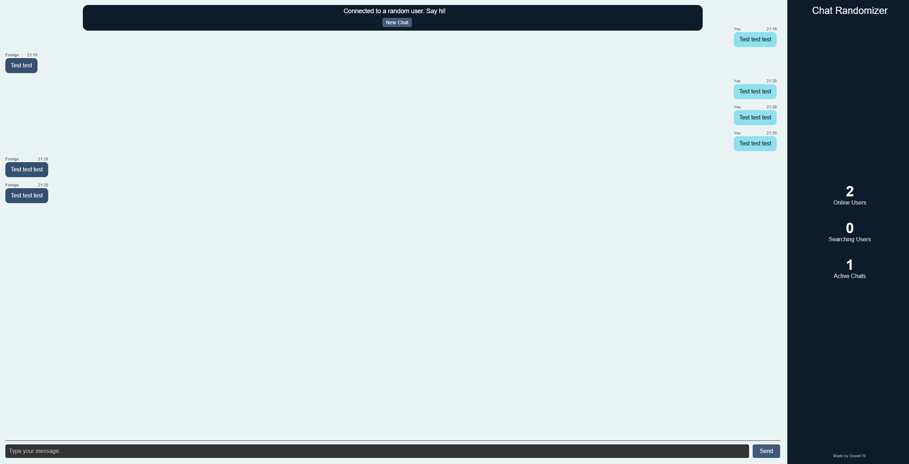

# CHAT RANDOMIZER

A minimal real-time chat app where users are randomly paired to talk with each other - built with **Next.js**, **Socket.IO**, and **TypeScript**.  
Instant matchmaking, live messaging, and simple UI - all in one evening project.

---

## Features

-  **Random Matchmaking** - click *“New Chat”* to instantly connect with a random user  
-  **Live Messaging** - powered by Socket.IO with real-time updates  
-  **User Presence** - see how many users are online and searching  
-  **Lightweight Backend** - Node.js + Express + Socket.IO, no database needed

---

## Tech Stack

**Frontend**
- Next.js
- TypeScript
- Socket.IO Client

**Backend**
- Node.js
- Express
- Socket.IO

## Getting Started

### Clone the repository
```bash
git clone https://github.com/your-username/chat-randomizer.git
cd chat-randomizer
```

### Install dependencies
```bash
cd backend
npm install
cd ..
cd frontend
npm install
```

### Environment Variables Frontend
<sub>Frontend (fontend/.env.local):</sub>
```bash
NEXT_PUBLIC_SOCKET_URL=http://localhost:4000
```

### Environment Variables Backend
<sub>Backend (backend/.env):</sub>
```bash
PORT=4000
```

<sub>Frontend on http://localhost:3000</sub>
```bash
cd frontend
npm run dev
```

### Run the development servers
<sub>Backend on: http://localhost:4000</sub>
```bash
cd backend
npm run dev
```

## Preview



## Author
**Created with by Dawid W.**


